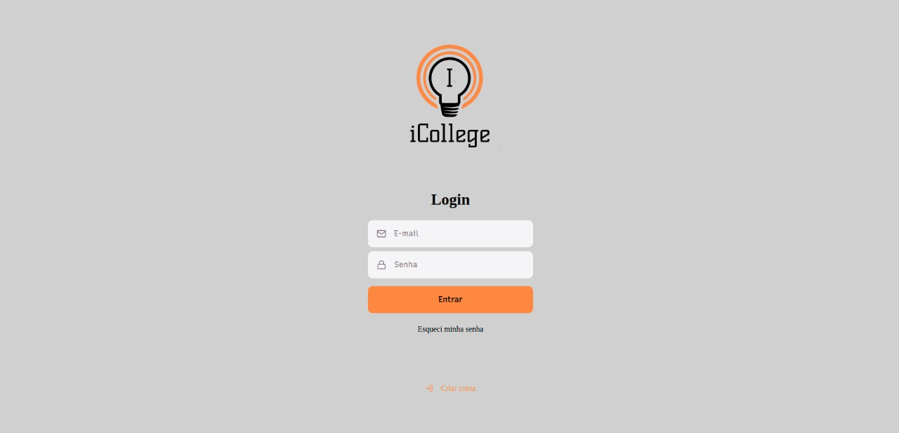
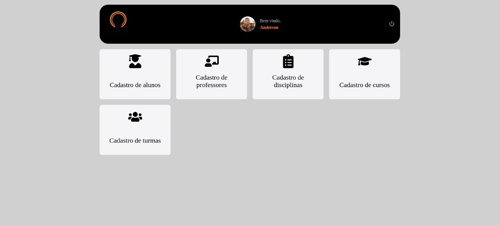

<h1 align="center">
    
</h1>

<h4 align="center">
	iCollege
</h4>
<p align="center">

  

  

  <a href="https://www.linkedin.com/in/pachecowebdev/">
    
  </a>

  <a href="https://github.com/PachecoWebDev/icollege/commits/master">
    
  </a>

  

  <a href="https://github.com/PachecoWebDev/icollege/stargazers">
    
  </a>

</p>
<p align="center">

  <a href="https://reactjs.org/" rel="nofollow">
    
  </a>
  </p>

## 💻 Projeto

Estamos em plena Pandemia. Um grupo de professores que saíram de suas universidades se reuniu para criar uma  instituição de ensino superior. Todos os processos e disciplinas vieram montadas e a criação de alguns cursos saiu de forma rápida. Pretendem já no próximo semestre iniciar as operações. Mas se deram conta de um problema. Não possuíam um sistema de matrícula que atendesse minimamente as
necessidades da nova instituição e dos alunos que se   atriculariam.

<h3 align="center">
    
</h3>


## :hammer: Tecnologias

Este projeto foi desenvolvido com as seguintes Ferramentas:

- [TypeScript][typescript]
- [React][reactjs]
- [VS Code][vs]

## 🚀 Como rodar este projeto

Para clonar e executar este aplicativo, você precisará de [Git](https://git-scm.com), [Node.js][nodejs] Instalado em seu computador.

### :cyclone: Clonando o repositório

```bash
# Clone este repositório
$ git clone https://github.com/PachecoWebDev/icollege

# Acesse a pasta do projeto no terminal/cmd
$ cd icollege
```

### 🧭 Rodando a aplicação web (Front End)

```bash

# Instale as dependências
$ npm install

# Execute a aplicação
$ npm run start

# A aplicação será aberta na porta:3000 - acesse http://localhost:3000
```

### Fazendo login na aplicação

<p>Usuário: anderson@anderson.com</p>
<p>Senha: 123456789</p>

## 🤔 Como contribuir para o projeto

- Faça um **fork** do projeto;
- Crie uma nova branch com as suas alterações: `git checkout -b my-feature`
- Salve as alterações e crie uma mensagem de commit contando o que você fez:`git commit -m "feature: My new feature"`
- Envie as suas alterações: `git push origin my-feature`

> Caso tenha alguma dúvida confira este [guia de como contribuir no GitHub](https://github.com/firstcontributions/first-contributions)

## :memo: Licença

Este projeto esta sobe a licença MIT. Veja a [LICENÇA][license] para saber mais.

Att. Anderson Pacheco 👨‍💻  [Vamos conversar!](https://www.linkedin.com/in/anderson-pacheco-oliveira-506474a1)

[nodejs]: https://nodejs.org/
[typescript]: https://www.typescriptlang.org/
[expo]: https://expo.io/
[reactjs]: https://reactjs.org
[rn]: https://facebook.github.io/react-native/
[vs]: https://code.visualstudio.com/
[rs]: https://rocketseat.com.br
[license]: https://opensource.org/licenses/MIT
